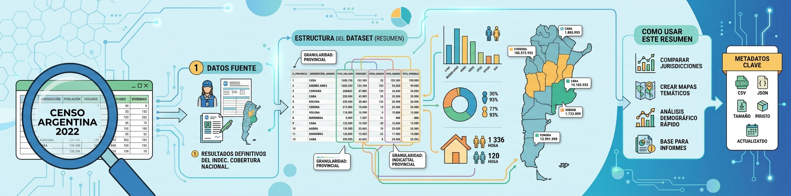

<p align="center">

</p>

# Dataset Censo Argentina 2022: resumen por jurisdicción

## 1. Descripción general

El dataset **Censo Argentina 2022: resumen por jurisdicción** contiene una versión tabular resumida de la población censada en la Argentina según los resultados definitivos del Censo Nacional de Población, Hogares y Viviendas 2022.

Cada fila representa una jurisdicción de primer orden: las 23 provincias argentinas y la Ciudad Autónoma de Buenos Aires. El archivo incluye población total, población por sexo registrado al nacer y distribución de la población según el tipo de relevamiento habitacional informado en la fuente.

La versión incluida en este repositorio está preparada como un CSV compacto para uso general. No agrega variables externas, como superficie o densidad, porque esos datos no forman parte del archivo fuente utilizado.

## 2. Referencia rápida

### 2.1 Resumen general

| Aspecto | Valor |
|---|---|
| Archivo principal | `provincias_resumen.csv` |
| Formato | CSV |
| Filas | 24 jurisdicciones |
| Columnas | 8 variables |
| Cobertura geográfica | Argentina, por jurisdicción |
| Año de referencia | 2022 |
| Fuente | INDEC, Censo Nacional de Población, Hogares y Viviendas 2022 |
| Archivo fuente | `c2022_tp_c_resumen.xlsx` |
| URL fuente | https://censo.gob.ar/wp-content/uploads/2024/01/c2022_tp_c_resumen.xlsx |

### 2.2 Estructura del archivo

| Campo | Tipo | Descripción |
|---|---|---|
| `codigo` | Texto | Código oficial de dos dígitos de la jurisdicción. |
| `provincia` | Texto | Nombre de la jurisdicción. Incluye provincias y Ciudad Autónoma de Buenos Aires. |
| `poblacion` | Entero | Población total censada en la jurisdicción. |
| `varones` | Entero | Población registrada como varón al nacer. |
| `mujeres` | Entero | Población registrada como mujer al nacer. |
| `vivienda_particular` | Entero | Población censada en viviendas particulares. |
| `vivienda_colectiva` | Entero | Población censada en viviendas colectivas. |
| `situacion_calle` | Entero | Población censada en situación de calle. |

### 2.3 Totales de control

| Variable | Total |
|---|---:|
| `poblacion` | 45.892.285 |
| `varones` | 22.186.791 |
| `mujeres` | 23.705.494 |
| `vivienda_particular` | 45.618.787 |
| `vivienda_colectiva` | 267.793 |
| `situacion_calle` | 5.705 |

## 3. Atributos y significado

### 3.1 Identificación territorial

**`codigo`**: código de jurisdicción de dos dígitos, compatible con la codificación oficial utilizada para provincias y Ciudad Autónoma de Buenos Aires.

**`provincia`**: nombre de la jurisdicción. El campo conserva nombres legibles para uso directo en tablas, gráficos, mapas o cruces con otros archivos territoriales.

### 3.2 Población por sexo registrado al nacer

**`poblacion`**: población total censada en la jurisdicción.

**`varones`**: población registrada como varón al nacer.

**`mujeres`**: población registrada como mujer al nacer.

En todas las filas se cumple:

```text
poblacion = varones + mujeres
```

### 3.3 Población por tipo de vivienda o situación de relevamiento

**`vivienda_particular`**: población censada en viviendas particulares.

**`vivienda_colectiva`**: población censada en viviendas colectivas.

**`situacion_calle`**: población censada en situación de calle.

En todas las filas se cumple:

```text
poblacion = vivienda_particular + vivienda_colectiva + situacion_calle
```

## 4. Origen y procedencia

### 4.1 Fuente primaria

Los datos provienen del Instituto Nacional de Estadística y Censos de la República Argentina (INDEC):

- Organismo: Instituto Nacional de Estadística y Censos (INDEC)
- Operativo: Censo Nacional de Población, Hogares y Viviendas 2022
- Resultados: definitivos
- Archivo fuente: `c2022_tp_c_resumen.xlsx`
- URL: https://censo.gob.ar/wp-content/uploads/2024/01/c2022_tp_c_resumen.xlsx

### 4.2 Tabla de origen

El archivo fuente corresponde al cuadro resumen:

> Total de población, población en viviendas particulares, población en viviendas colectivas y población en situación de calle, por jurisdicción y sexo registrado al nacer. Año 2022.

## 5. Proceso de curaduría

La versión `provincias_resumen.csv` fue preparada a partir del archivo Excel original con las siguientes transformaciones:

- Se conservaron únicamente las jurisdicciones provinciales y la Ciudad Autónoma de Buenos Aires.
- Se excluyó la fila `Total del país`.
- Se seleccionaron las columnas de resumen para población total, varones, mujeres, viviendas particulares, viviendas colectivas y situación de calle.
- Se agregaron códigos oficiales de jurisdicción de dos dígitos cuando el nombre pudo vincularse de manera confiable.
- Se normalizaron los nombres de jurisdicción con tildes y denominaciones legibles.
- Se dejaron todos los conteos como números enteros.
- No se incorporaron columnas externas al archivo fuente, como superficie, densidad u otras variables territoriales.

En el archivo fuente, algunas celdas de `situacion_calle` aparecen con marcadores no numéricos. En esta versión se representan como `0` cuando el cierre aritmético de la fila indica ausencia de población en esa categoría.

## 6. Posibles usos

El dataset puede utilizarse para consultar, comparar y cruzar información poblacional por jurisdicción. También sirve como tabla territorial compacta para análisis descriptivo, documentación de datos públicos, ejercicios de lectura de CSV y cruces con geometrías provinciales u otros indicadores jurisdiccionales.

## 7. Consideraciones

Los valores representan resultados definitivos del Censo 2022 y deben interpretarse según las definiciones oficiales del INDEC.

El campo `provincia` se usa como nombre genérico de jurisdicción por brevedad, pero incluye también a la Ciudad Autónoma de Buenos Aires.

La categoría de sexo registrada en el archivo corresponde a la variable publicada por la fuente: sexo registrado al nacer. De acuerdo con la nota metodológica del INDEC, la categoría X fue redistribuida entre las categorías mujer/femenino y varón/masculino en los resultados definitivos.

## 8. Acceso y uso

El archivo principal de este dataset es:

```text
provincias_resumen.csv
```

Ejemplo de carga con Python:

```python
import pandas as pd

df = pd.read_csv("provincias_resumen.csv", dtype={"codigo": "string"})

print(df.shape)
print(df.head())
```

Si se trabaja con códigos de jurisdicción, conviene cargar `codigo` como texto para conservar el cero inicial de códigos como `02` y `06`.

## 9. Cita recomendada

Instituto Nacional de Estadística y Censos (INDEC). (2024). *Censo Nacional de Población, Hogares y Viviendas 2022: resultados definitivos. Cuadro resumen por jurisdicción y sexo registrado al nacer*. https://censo.gob.ar/wp-content/uploads/2024/01/c2022_tp_c_resumen.xlsx

---

Última actualización: Octubre 2026.
